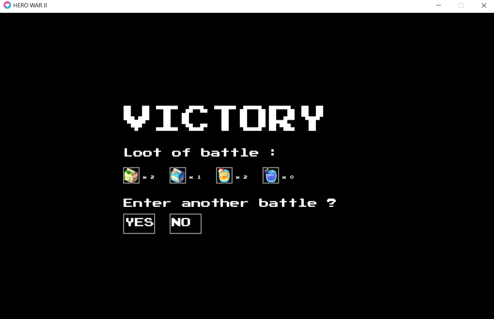

# Hero-War-II
Version 1.0 of the text based fighting game between heroes from legend, and developped in Lua and LOVE 2D framework.

# Systèmes Implémentés

+ Un menu principal d'ou commence toute la partie :

+ Choississez parmi quatre héros principals :

+ Un système de combat au tour par tour, à l'infini jusqu'à la défaite du joueur avec un sytème de level Up pour le joueur et un inventaire :

+ Un système de loot en cas de victoire :

+ Une liste fixe de badge prise en compte pour la section de fenetre en cours :

