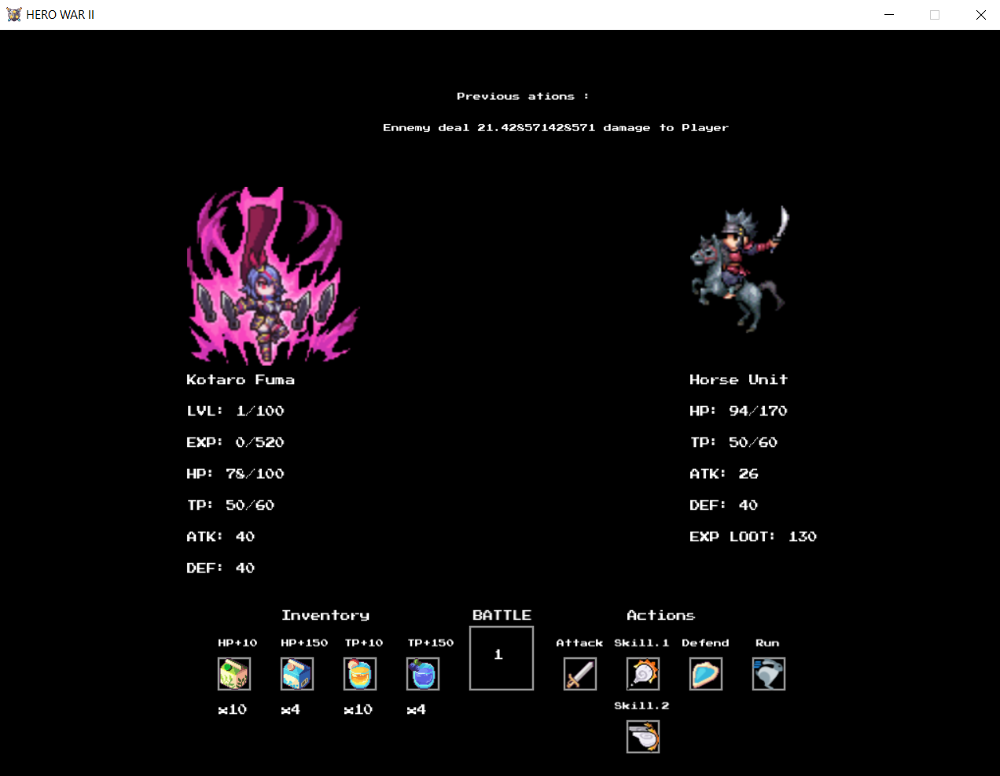

# Hero-War-II
A text based fighting game between heroes from legend, and developped in Lua and LOVE 2D framework.

# Systèmes Implémentés

+ Un menu principal d'ou commence toute la partie :
+ 

+ Choississez parmi quatre héros principals :
+ 

+ Un système de combat au tour par tour, à l'infini jusqu'à la défaite du joueur :
+ 

+ Une liste fixe de badge prise en compte pour la section de fenetre en cours :
+ 

